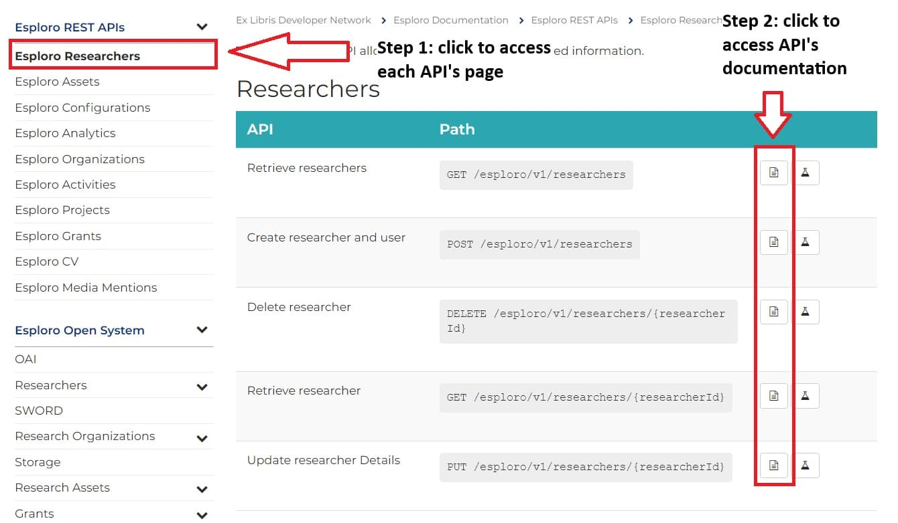

## Relevant Ex Libris Documentation
- [Esploro REST APIs](https://developers.exlibrisgroup.com/esploro/apis/)
- [How we're building APIs at Ex Libris](https://developers.exlibrisgroup.com/blog/How-we-re-building-APIs-at-Ex-Libris/)

Last updated 1/13/2025 - Norman Lee

## Getting Started
Using the Esploro API requires an [Ex Libris Developer Network](https://developers.exlibrisgroup.com/) account. To request an account, [contact Rami](mailto:rattebur@uidaho.edu).

You can use the API's by either using the Developer Network's web interface or writing some sort of script. The web interface is more user friendly, but significantly limits the number of records you can call at one time.

All Esploro API's are [REST API's](https://developers.exlibrisgroup.com/esploro/apis/#about), meaning that you can interact with them in one of four ways (called 'methods'):

- GET – retrieve a resource
- POST – create a resource
- PUT – update a resource (in a “swap all” mode – this means that the entire existing entity will be replaced with the incoming entity. Calling applications are expected to run a GET before PUT, and send the entire entity with the relevant fields modified. Missing fields will be given default values.)
- DELETE – delete a resource

However, not every API allows all four methods. For instance, the [researchers API](https://developers.exlibrisgroup.com/esploro/apis/researchers/) does, but the [assets API](https://developers.exlibrisgroup.com/esploro/apis/assets/) doesn't let you DELETE.

Moreover, you also need [API keys](https://developers.exlibrisgroup.com/manage/keys/) to use an API and some API keys are read-only, which means they can only GET. So, to use the API you need a combination of the correct API method along with the correct key. For more infomation about API keys and their permissions [see here](https://developers.exlibrisgroup.com/alma/apis/#defining).

## Using the API's via the Developer Network

To use the API web interface, navigate to the [API Console](https://developers.exlibrisgroup.com/console/) and select your desired API. You can find definitions of each API on their documentation pages:

Make sure you are on the correct server: `https://api-na.hosted.exlibrisgroup.com`.

Make sure the correct API key is selected. A few things to keep in mind:

- Use read-only API keys whenever possible to avoid mistakenly modifying or deleting data
- You may have to create your own API key to do what you want
- That said, please keep the number of API keys you create to a minimum. Having too many API keys associated with the U of I's account can break the API Key dropdown within the API Console, making selecting the correct key impossible.

Hit "Try it out" on your desired API URL, then enter the relevant parameters in the form provided. *Note*: many API's have a `q` parameter. That parameter has a special syntax which can be found [here](https://developers.exlibrisgroup.com/blog/How-we-re-building-APIs-at-Ex-Libris/#BriefSearch). In the past Ex Libris has also changed the syntax of the `q` field without updating the documentation, which may break queries.

Hitting "execute" will run your query. *Note:* by default Ex Libris returns a json document, but it can return XML. This can be changed using the "media type" dropdown. Switching to XML is sometimes useful for debugging, because it displays an informative error messages, while json often doesn't.

## Using the API's via a Script