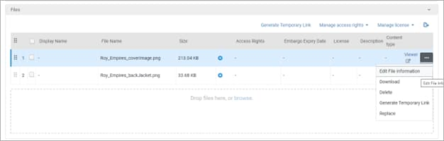

## Relevant Ex Libris Documentation
-
## Adding Thumbnail Images for Assets
Last Updated: 3/6/2024, Jeremy Kenyon

To create a thumbnail image for an asset you have two options:

1. Add an entire full-text version of file, e.g. a PDF of an open access journal article or ETD.  
2. Add an image file, e.g. a .png or .jpeg of a book cover.

**Adding an entire file**

For option \#1, the thumbnail will be generated from the first page of the file. We currently see those images created for dissertations and theses, where the entire file is available in VERSO.

In the Back Office:

1. Find the asset by searching and click on the title.  
2. In the Asset editing screen, look for the “Files” section, near the top. You should see a dashed line box that says “Drop files here, or browse”.  
3. Add the file there.  
4. Scroll to the top, and click on “Save”. The file should be added.

Alternatively, you can create the asset.

1. Go to Repository \> Deposit Asset.  
2. Add at least an academic unit and choose an asset type.  
3. Once you’ve done so, you will see the “Files” section appear. You should see a dashed line box that says “Drop files here, or browse”.  
4. Add the file there.  
5. Scroll to the top, and click on “Next”. Continue to add metadata for the asset as appropriate.  
6. Scroll to the top and click Save when finished.

**Adding an image file only (e.g. book covers)**

Using the same methods for adding files as above, add a single image file that you want to have show up as the thumbnail image.

Once added in the back office:

1. Click on the 3 dots to the right of the file and select “Edit File Information”.

2. Within that box, give the image a “Display Name” and check the “Supplemental” box at the bottom.  
   1. Not checking the box will treat the file as an article deposit and make the “Open Access” tag appear on the asset. If it is not an OA asset, this is misleading.  
3. Click Save in the File Information box.  
4. Scroll to the top and click Save to save changes to the asset.  
5. Check the asset in the research portal to make sure everything worked as expected.