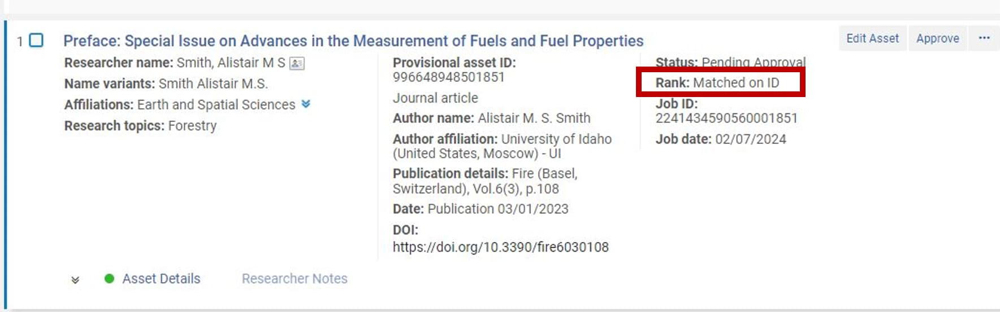
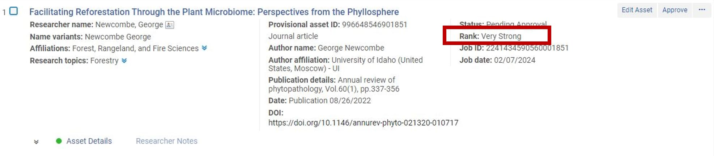
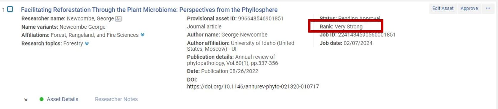

## Relevant Ex Libris Documentation
-

## Approving Authors and Assets

Last Updated: 2/9/2024, Jeremy Kenyon

After running a harvest, you will have two steps: Author Matching and Asset Approval.

Go to Repository \> Smart Harvesting \> Author Matching Approval Task List

- Important: Make sure you are looking at items classified (in the Facets) as “Pending Approval”.

    
- For items “Matched on ID”, you can reasonably expect that Esploro’s “guess” is accurate. You can likely bulk update these items.  

- For items in the “Very Strong”, “Strong, or “Uncertain” categories, take a closer look. The Very Strong and Strong are likely to be accurate. The Uncertain is very…uncertain. Often these are matched on initials rather than full names. Click on the DOI to view the digital object that is referenced and investigate. Sometimes, the document will have author affiliations that will allow you to confirm whether the person is a UI researcher. 

Once you have matched all authors, go to the Asset Approval list.

Repository \> Smart Harvesting \> Asset Approval

Once here, you have the option to edit any information. Scan the list and look for problems. If you see none, go ahead and Select All, then “Approve”.